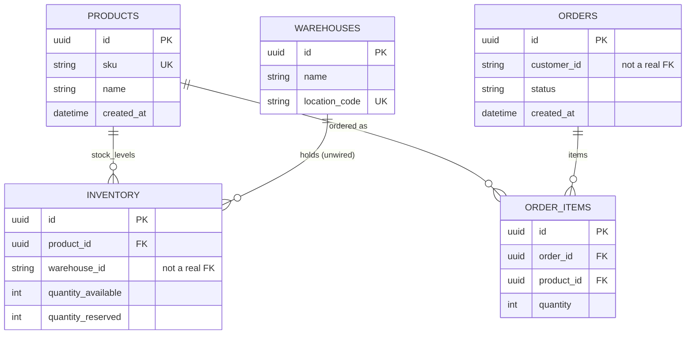
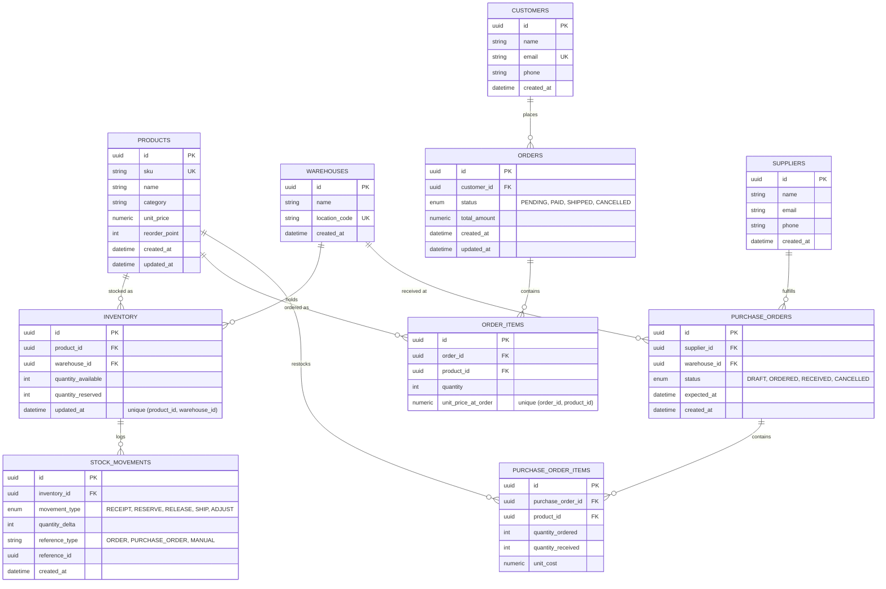

# AtlasIMS — Current Data Schema

Reflects `backend/app/modules/*/models.py` as of the latest commit. This is
the schema _as implemented_, including the gaps called out at the bottom.

## Notes / known gaps

- `Inventory.warehouse_id` is a plain `String`, **not** a foreign key to
  `warehouses.id` — the dotted relationship above isn't enforced in the
  database today.
- `Orders.customer_id` is a plain `String` — there's no `Customer` table.
- `Order.status` is free text (`PENDING`/`PAID`/`SHIPPED`/`CANCELLED` by
  convention only, not a DB-level enum/check constraint).
- No unique constraint on `(product_id, warehouse_id)` in `inventory`, so
  duplicate stock rows for the same product/warehouse are possible.
- No quantity check constraints (e.g. `quantity_available >= 0`).
- No `unit_price` on `OrderItem`, and no price field on `Product` at all.
- No `updated_at` timestamps on `Inventory` or `Order`.

---

# Proposed Schema (Enhanced)

Fixes every gap above, and adds the pieces a real IMS needs: customers,
suppliers, purchase orders (inbound stock), and a stock-movement ledger so
inventory changes are auditable instead of just an overwritten counter.

## What changed vs. the current schema

- **`Inventory.warehouse_id` is a real FK** to `warehouses.id`, with a unique
  constraint on `(product_id, warehouse_id)` so stock can't fork into
  duplicate rows.
- **`Customer` is a real table**, referenced by `Orders.customer_id` — no
  more free-text customer identifiers.
- **`Order.status` and `PurchaseOrder.status` become DB-level enums**
  instead of unchecked strings.
- **`StockMovements`** gives an append-only audit ledger for every quantity
  change (receipt, reservation, shipment, manual adjustment), so
  `quantity_available`/`quantity_reserved` are derived/verifiable instead of
  the only source of truth.
- **Pricing is modeled**: `Product.unit_price` as the current price, and
  `OrderItem.unit_price_at_order` to freeze the price actually charged so
  later price changes don't rewrite history.
- **Inbound stock is modeled** via `Supplier` → `PurchaseOrder` →
  `PurchaseOrderItem`, mirroring the existing `Order`/`OrderItem` shape for
  outbound stock — without it there's no way to represent how inventory
  ever gets replenished.
- **`updated_at` timestamps** added to `Inventory`, `Orders`, and `Products`
  so changes are traceable.
- **`reorder_point`** on `Product` gives a hook for low-stock alerts, a
  standard IMS feature that's currently absent entirely.
